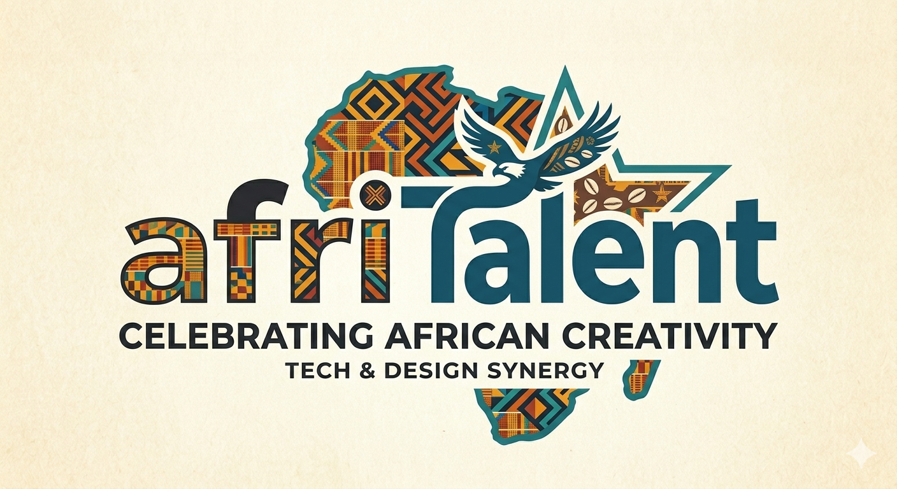
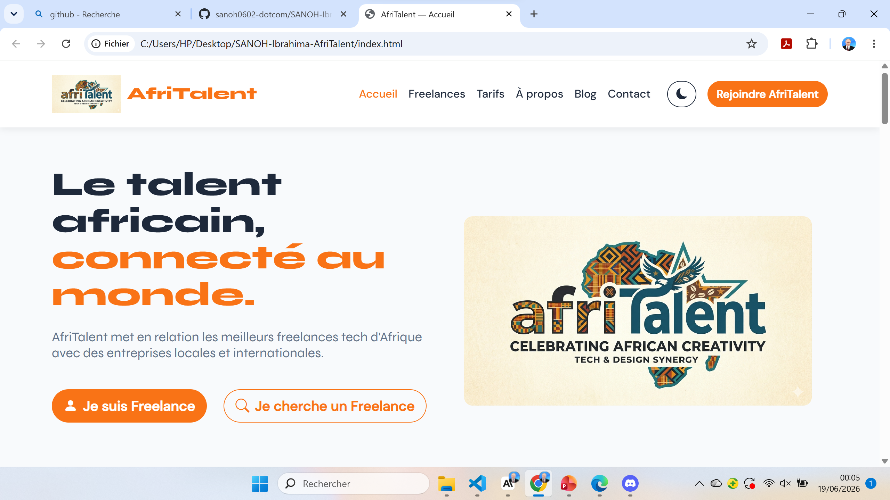
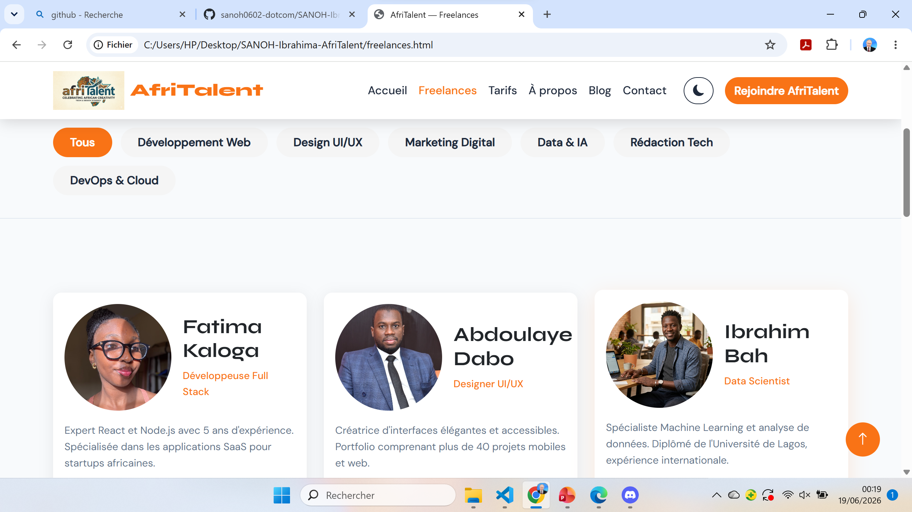

# AfriTalent 🌍



## 📌 Présentation du projet

**AfriTalent** est une plateforme fictive de mise en relation entre freelances tech africains et entreprises locales et internationales. Ce projet a été réalisé dans le cadre du Semestre 2 à l'ISI Dakar(Institut Supérieur d'Informatique).

> Plateforme fictive — Projet académique individuel

---

## 👨‍💻 Informations

| Élément        | Détail                            |
| -------------- | --------------------------------- |
| **Projet**     | AfriTalent — Site vitrine complet |
| **Étudiant**   | IBRAHIMA SANOH                    |
| **Classe**     | Réseaux Télécoms                  |
| **Professeur** | Robert DIASSÉ                     |
| **Date**       | 03/07/2026                        |

---

## 🚀 Lien GitHub Pages

🌐 **[Voir le site en ligne](https://sanoh0602-dotcom.github.io/SANOH-Ibrahima-AfriTalent/)**

---

## 📄 Pages du site

| Page              | Description                                       |
| ----------------- | ------------------------------------------------- |
| `index.html`      | Page d'accueil avec hero, catégories, témoignages |
| `freelances.html` | Catalogue de 9 profils freelance avec filtres     |
| `tarifs.html`     | 3 plans tarifaires + FAQ accordion                |
| `about.html`      | Histoire, équipe, valeurs, chiffres clés          |
| `contact.html`    | Formulaire de contact avec validation             |
| `blog.html`       | Articles et ressources                            |

---

## 🛠️ Technologies utilisées

- **HTML5** — Structure sémantique rigoureuse
- **CSS3** — Flexbox, Grid, Bento Grid, animations, variables CSS
- **Bootstrap 5** — Navbar, cards, carousel, accordion, modal
- **Bootstrap Icons** — Icônes
- **Google Fonts** — Syne (titres) + DM Sans (corps)
- **JavaScript Vanilla** — 7 fonctionnalités interactives
- **Git & GitHub** — Versioning + GitHub Pages

---

## ✨ Fonctionnalités principales

- 🌙 **Dark mode / Light mode** avec persistance localStorage
- 📊 **Compteurs animés** au scroll (IntersectionObserver)
- 🔍 **Filtrage dynamique** des freelances par catégorie
- ✅ **Validation formulaire** avec messages d'erreur en temps réel
- 📱 **Responsive design** — Mobile (375px), Tablette (768px), Desktop (1200px+)
- 🎯 **Animations fade-in** au scroll (IntersectionObserver)
- 🔝 **Bouton retour en haut** avec smooth scroll
- 👤 **Modal profil** Bootstrap pour chaque freelance

---

## 📁 Structure du projet

```
SANOH-Ibrahima-AfriTalent/
├── index.html
├── freelances.html
├── tarifs.html
├── about.html
├── contact.html
├── css/
│   └── style.css
├── js/
│   └── main.js
├── images/
│   └── (logos, avatars, photos)
├── docs/
│   └── NOM_Prenom_Presentation.pptx
├── README.md
└── .gitignore
```

---

## 📚 Ressources consultées

| Ressource       | URL                                |
| --------------- | ---------------------------------- |
| MDN Web Docs    | https://developer.mozilla.org/fr/  |
| Bootstrap 5     | https://getbootstrap.com/docs/5.3/ |
| Bootstrap Icons | https://icons.getbootstrap.com/    |
| Google Fonts    | https://fonts.google.com/          |
| CSS-Tricks      | https://css-tricks.com/            |
| W3C Validator   | https://validator.w3.org/          |
| Pexels (images) | https://www.pexels.com/            |

---

## 📸 Captures d'écran

### Page d'accueil



### Page Freelances



---

_Projet réalisé avec déterminations dans le cadre du cours de Développement Web — ISI 2026_
